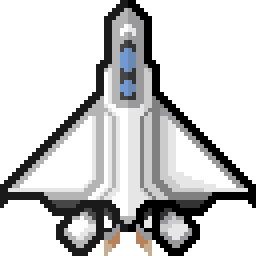
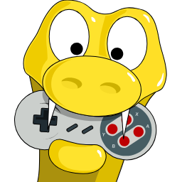
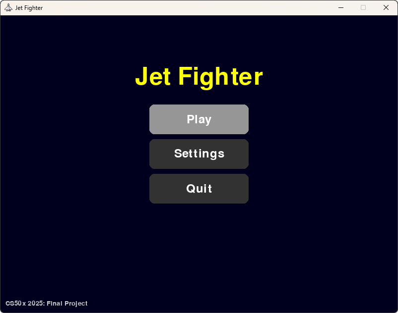
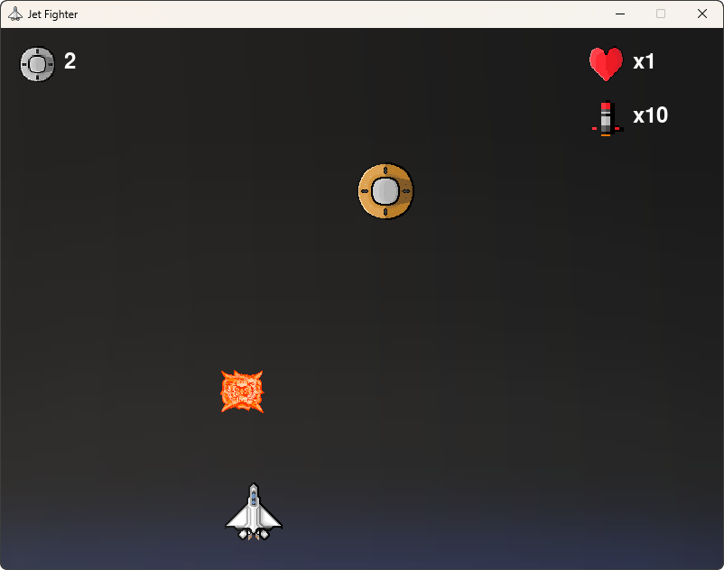
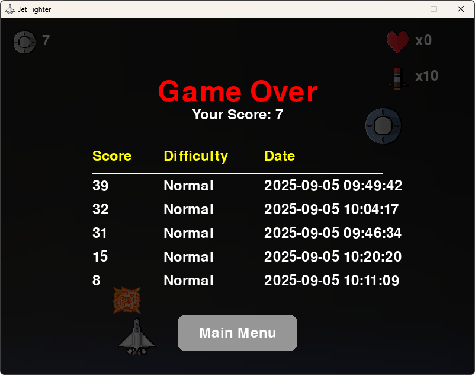

# Jet Fighter

<p align="left">
  
  
  
  
</p>

**Jet Fighter** is a 2D arcade-style shooter developed as a **CS50x 2025 Final Project**. Pilot your jet, destroy enemies, and compete for high scores!

[Youtube Video](https://youtu.be/dFv8IsB_U1c)

---

## Table of Contents

- [Gameplay](#gameplay)
- [Screenshots](#screenshots)
- [Installation](#installation)
- [Settings](#settings)
- [Controls](#controls)
- [Game Dynamics](#game-dynamics)
- [Disclaimer](#disclaimer)
- [License](#license)

---

## Gameplay

- Fly your jet using arrow keys.  
- Press **SPACE** to fire missiles.  
- Destroy enemies and bosses to earn points.  
- Collect missiles to survive longer.  
- High scores are saved to a local SQLite database.

---

## Screenshots

**Main Menu:**  


**Gameplay:**  


**Game Over & High Scores:**  


---

## Installation

1. Clone the repository:

```bash
git clone https://github.com/ztrahmet/pygame-jetfighter.git
cd pygame-jetfighter
````

2. Create a virtual environment (optional but recommended):

```bash
python -m venv .venv
```

3. Activate the virtual environment:

* **Windows:**

```bash
.venv\Scripts\activate
```

* **macOS/Linux:**

```bash
source .venv/bin/activate
```

4. Install dependencies:

```bash
pip install -r requirements.txt
```

5. Run the game:

```bash
python -m src.main
```

---

## Settings

* **Difficulty:** Easy / Normal / Hard
* Current difficulty is displayed in the Settings menu.
* Adjust difficulty to change enemy spawn rate, enemy limits, and missile availability.

---

## Controls

| Key         | Action                |
| ----------- | --------------------- |
| Left Arrow  | Move jet left         |
| Right Arrow | Move jet right        |
| Space       | Fire missile          |
| ESC         | Exit settings or menu |

---

## Game Dynamics

**Jet Fighter** gameplay mechanics:

* **Player Jet:**

  * Starts with **3 hearts** (lives).
  * Can move left and right using the arrow keys.
  * Fires missiles using the **SPACE** key.

* **Missiles:**

  * Player starts with a limited number of missiles.
  * Shooting a regular enemy grants **+1 missile**.
  * Shooting a **Boss enemy** grants **+3 missiles**.
  * Running out of missiles **and having no missiles in flight** ends the game.

* **Enemies:**

  * Spawn at the top of the screen at a rate depending on difficulty.
  * Colliding with the player reduces **1 heart**.
  * Reaching the bottom of the screen also reduces **1 heart**.
  * Destroying enemies grants **1 point**.

* **Bosses:**

  * Spawn rarely and grant bonus rewards when destroyed.
  * Destroying a boss grants **3 missiles**.
  * Destroying a boss grants **1 point** per boss hit.

* **Scoring & Milestones:**

  * Each destroyed enemy or boss adds to the **score**.
  * Every **10 points**, a **milestone sound** plays to celebrate the achievement.

* **Game Over Conditions:**

  * Player hearts reach **0**.
  * Player runs out of missiles **and no missiles remain on screen**.

* **Other Features:**

  * Explosions are shown when enemies or bosses are destroyed.
  * Game keeps a **high score database** for top scores per difficulty.
  * Player has a **blinking effect** for a short time after taking damage.

---

## Disclaimer

This project, **Jet Fighter**, is a **CS50x 2025 Final Project** submitted for educational purposes.
All assets and code are created for learning and demonstration within the context of CS50x 2025.

---

## License

This project is licensed under the [GNU General Public License v3](LICENSE).
You are free to use, modify, and distribute this project under the same license.
